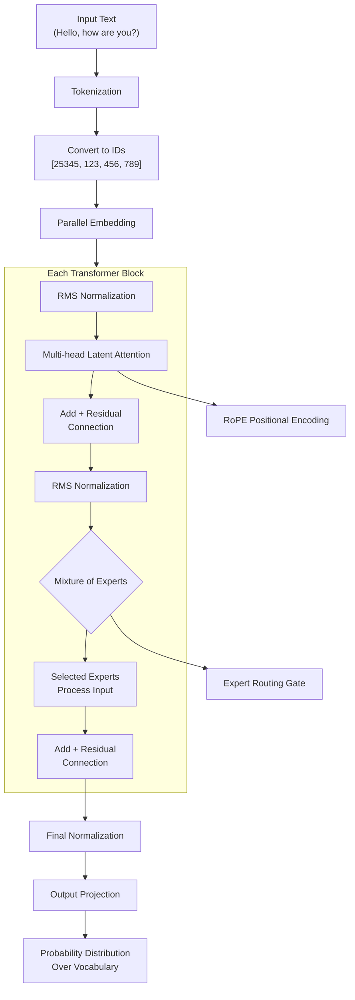

# DeepSeek V3 From Scratch

In late January 2025, DeepSeek overtook ChatGPT as the most downloaded AI app in the App Store, thanks to its faster and better performance. 
This headline made me question how a much smaller company with less development time could have overtaken the biggest AI company seemingly out of nowhere. 
This made me research how this was possible, and after reading [DeepSeek's technical report](https://arxiv.org/pdf/2412.19437) on its V3 model, I was able to understand.

The key innovation was their Multi-head Latent Attention (MLA) architecture, which dramatically improves efficiency without sacrificing performance. 
I decided to implement a simplified version from scratch based on their 
[open-source repository](https://github.com/deepseek-ai/DeepSeek-V3/tree/main) to truly understand how it works.

---

## Core Architectural Innovations

DeepSeek V3's breakthrough comes from three key innovations:

1. **Multi-head Latent Attention (MLA)** - Instead of treating all words equally, this smart attention system splits the work into two parts:
   one that understands word meanings and another that understands word positions.
2. **Rotary Positional Encoding with YARN** - Regular models might get confused with long sentences, but DeepSeek's system
   uses mathematical tricks to remember word positions even in very long texts.
4. **Mixture of Experts with Dynamic Routing** - Only a small subset of specialized experts (sub-networks) are activated per request,
   ensuring inputs are directed to the most relevant experts.

---

## How DeepSeek V3 Works: A Visual Guide

Here's what happens inside DeepSeek V3 when you give it input text:

This technology happens through three key areas: the attention mechanism understands relationships between words, 
the positional encoding tracks word order, and the expert system specializes in different types of information.

---

## Technologies Chosen

I selected technologies that would help me understand and implement DeepSeek's architecture while maintaining educational clarity:

- **PyTorch** - For building and training the neural network architecture with GPU acceleration
- **Python Typing** - For clear type annotations and better code understanding
- **NumPy** - For mathematical operations and array manipulations
- **Dataclasses** - For clean configuration management of model parameters

Each choice served a specific purpose: PyTorch provided the neural network foundation, type annotations made the code more readable, and dataclasses helped manage the complex configuration required for DeepSeek's architecture.

---

## Implementation Phases

### Phase 1: Core Architecture Components

I started with the basic components that every transformer needs:

First, I created the embedding system that converts words into numbers the model can understand. 
This was tricky because DeepSeek uses a parallel approach that spreads the vocabulary across multiple devices for efficiency.

Next came the linear layers with quantization support which was like optimized pipelines that can handle different types of data.
Some were optimized for speed (FP8), others for precision (BF16). The challenge was making sure data flowed correctly through all these different pipe types.

### Phase 2: Attention Mechanism

This was where DeepSeek's real innovation lives. I implemented their Multi-head Latent Attention system:

The key insight was splitting attention into two streams, one that processes word content and another that handles word positions. 
It's like having two specialists working together: one who knows what words mean, and another who understands how they relate to each other in a sentence.

I also implemented their clever KV cache system. Normally, models need to remember everything they've ever seen, which gets expensive. 
DeepSeek compresses this memory using mathematical tricks in order to be even more efficient.

### Phase 3: Mixture of Experts

This part felt like building a team of specialists. Instead of having one giant brain that tries to do everything, DeepSeek uses many smaller expert brains:

I created a routing system that looks at each piece of text and decides which experts should handle it. 
Coding questions go to coding experts, math problems to math experts, and so on. 
The challenge was designing this routing system to be fast and accurate since it has to make decisions in milliseconds.

### Phase 4: Complete Integration

The final phase was integrating all these components into a cohesive system:

I connected the embedding system to the attention mechanism, hooked up the expert network, 
and made sure all the data flowed correctly between components. By making sure that the system was working smoothly, 
Deepseek was able to efficiently undergo computations.

The most satisfying moment was when I could feed in text and see coherent output emerge from all these interconnected systems working together.

---

## Challenges Faced

Building DeepSeek V3 from scratch presented several significant challenges:

- Understanding MLA’s separation of positional and semantic attention
- Implementing RoPE with YARN scaling for long sequence stability
- Designing compressed KV caching without loss of contextual information
- Developing an efficient expert routing mechanism under tight latency constraints
- Maintaining numerical stability across quantization formats
- Ensuring scalability across distributed training setups

The most complex part was understanding how all components interact, particularly how the KV cache compression works with the attention mechanism without losing important information.

---

## Lessons Learned

This implementation taught me several valuable lessons about modern AI architecture:

1. DeepSeek shows that smart architectural choices can outperform simply adding more parameters
2. KV cache compression illustrates how to balance capacity with efficiency
3. MoE proves that dynamic computation allocation can significantly improve efficiency
4. Advanced techniques like RoPE and YARN extensions require deep mathematical understanding
5. Supporting multiple formats like (FP8/BF16) requires careful numerical design
6. Well-defined interfaces between components make complex systems manageable

The most important insight was understanding that breakthrough performance often comes from rethinking fundamental assumptions rather than incremental improvements.

---

## Final Thoughts

What started as curiosity about DeepSeek's surprising success turned into one of the most educational deep dives I've done into AI architecture.

Implementing the model from scratch forced me to understand not just what each component does, but why it works and how all pieces fit together.
The experience gave me a much deeper appreciation for the architectural innovations that make modern AI models efficient.

It's not just about having the most parameters, but about using them in the most intelligent way possible
through smart attention mechanisms, efficient memory usage, and dynamic computation patterns.

This implementation helped me understand why DeepSeek V3 was able to outperform much larger models and that breakthrough performance comes from architectural innovation, not just scale.
The main factor comes from the MLA attention mechanism, combined with efficient KV caching and expert routing, creates a model that's both powerful and efficient.

The project also reinforced the value of understanding fundamentals. By building from scratch, I gained insights that would have been difficult
to get from just reading papers or using pre-built models.

It was a challenging but incredibly rewarding experience that significantly deepened my understanding of modern AI architecture.
